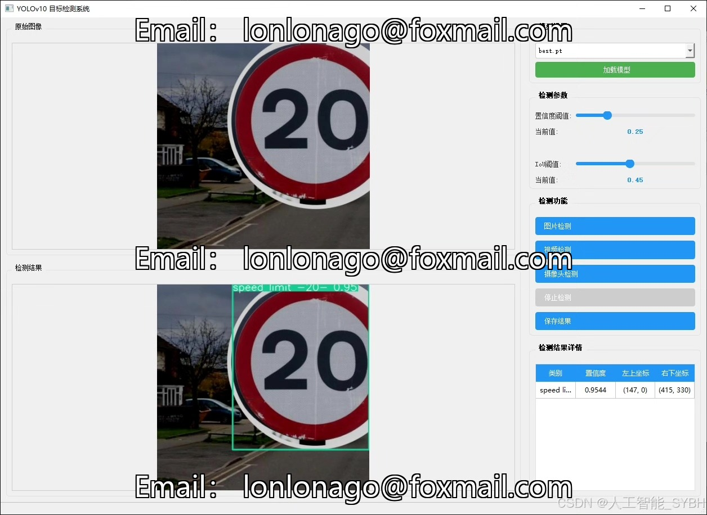
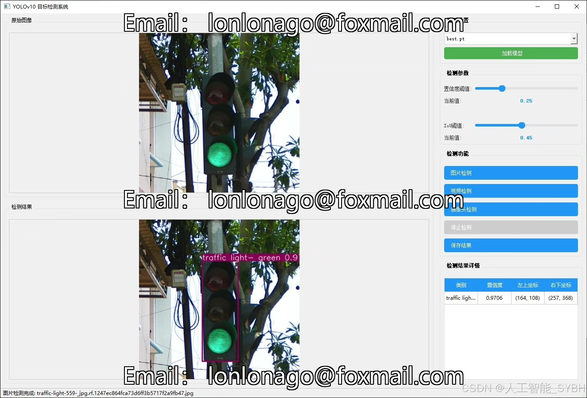
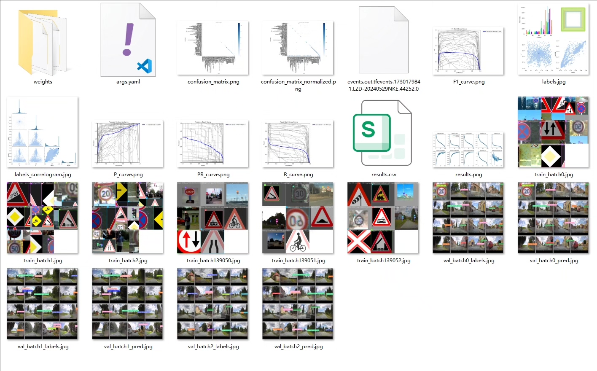
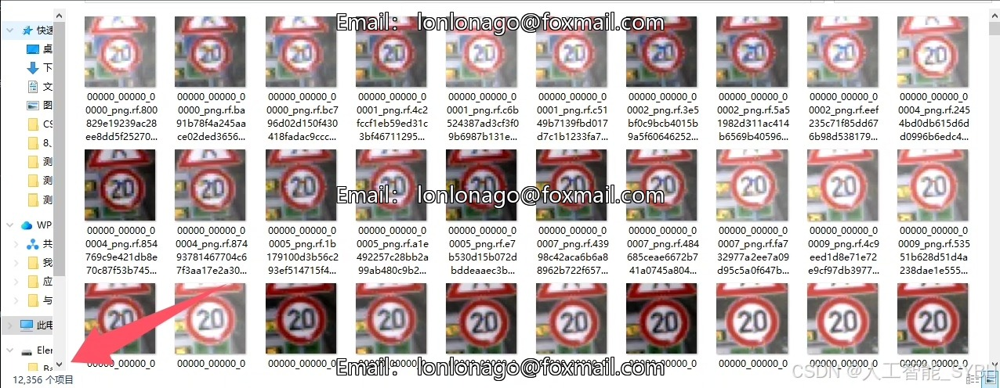
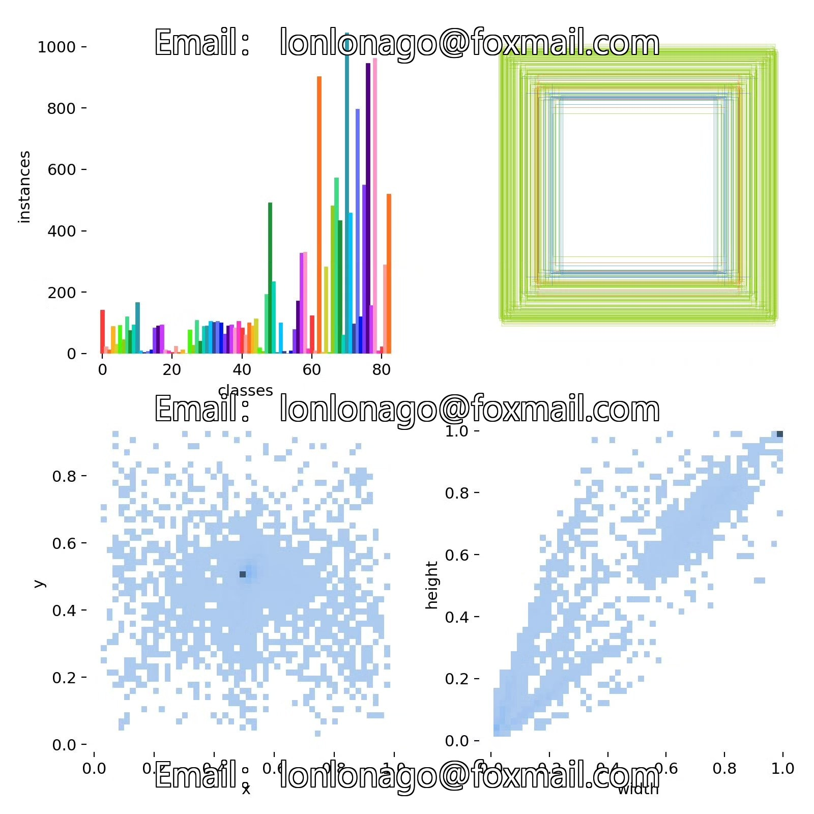
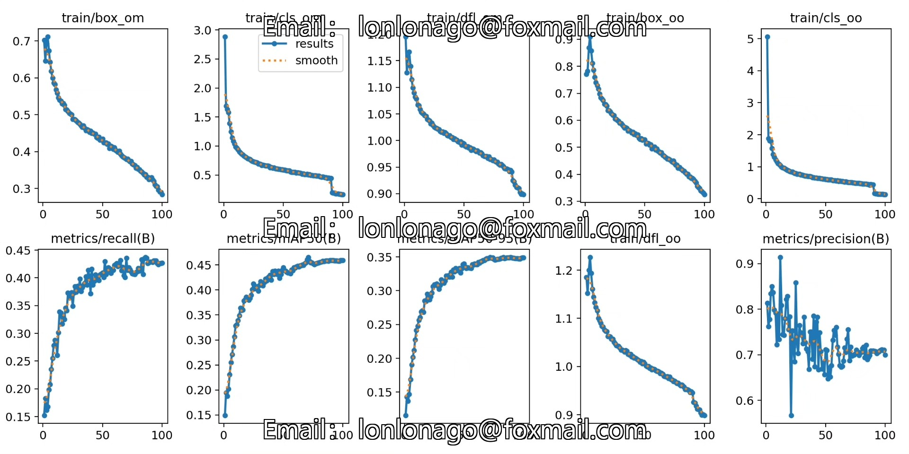
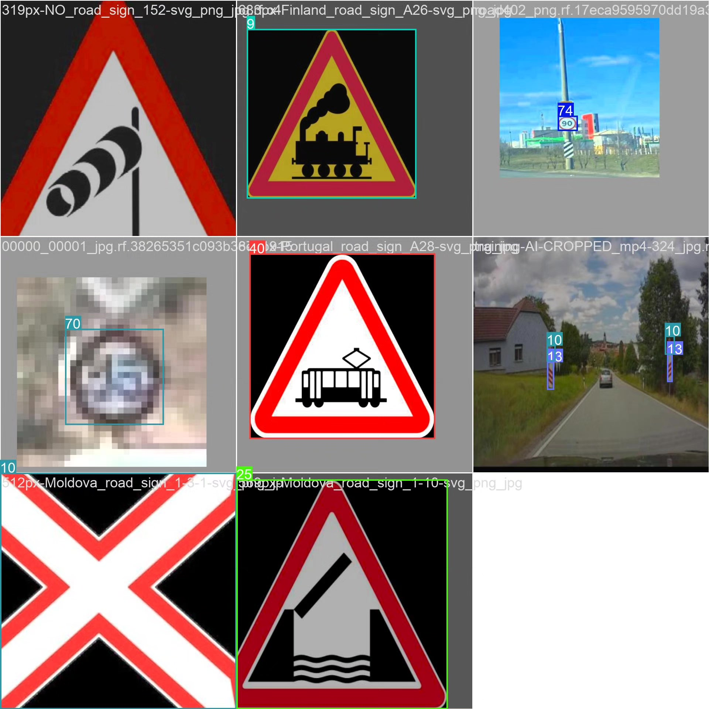
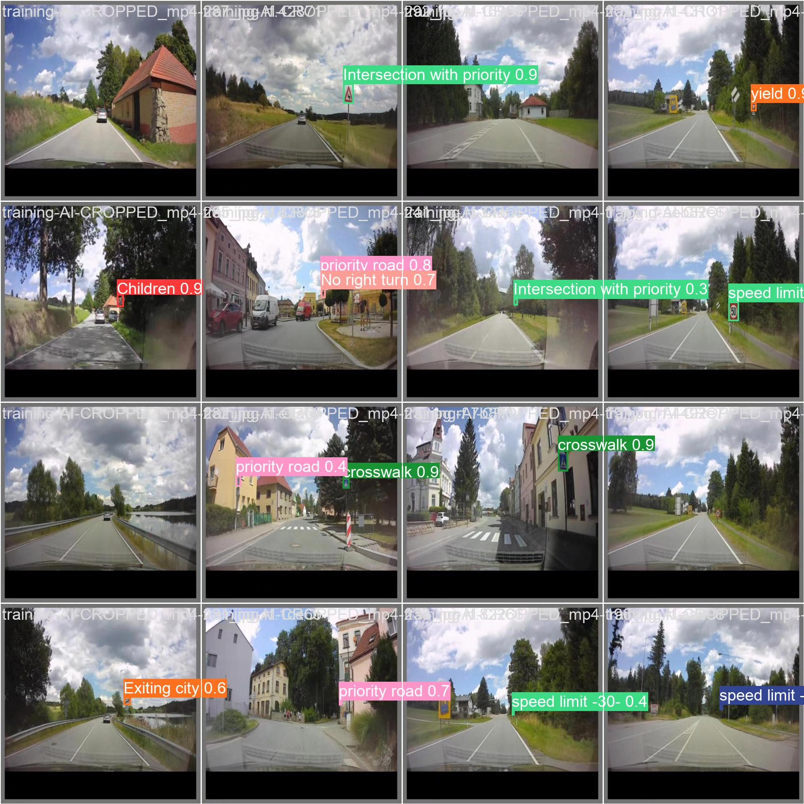

# Traffic sign detection system based on YOLOv10 deep learning

## Body

Based on the YOLOv10 deep learning, a traffic sign detection system (YOLOv10+YOLO dataset + UI interface + Python project source code + model) is developed.

This project aims to develop a traffic sign detection system based on YOLOv10, which can achieve efficient detection and recognition of traffic signs through computer vision technology. The system can process real-time video streams or images from traffic surveillance cameras, automatically identify and label them as traffic signs, providing technical support for autonomous driving, intelligent transportation systems, and traffic management.

Dataset composition:
Training set: 12356 images
Validation set: 1266 images
Test set: 654 images

The company's products have obtained the official commercial license certification of YOLO

Package after-sales service

After payment, we will provide WeChat IDs, answering questions anytime

Environment configuration: A tutorial on environment configuration will be provided, with WeChat providing answers in case of questions

Remote installation services: If you need remote configuration, an additional fee of 69 is required,
If the configuration fails, all fees will be refunded (specially for old computers only refund installation fees)

Retraining dataset: After setting up the environment, you can train on your own computer.
If you need us to retrain, just pay 69+ computing power fees (2.5 yuan/hour)

Full after-sales service

## Images

## Payment

Here is a pay link on Stripe ( https://buy.stripe.com/3cs8yP7sY87d0vu9AB ). Please contact me lonlonago@foxmail.com after funding $89, and I will send you a complete data files , thank you!

